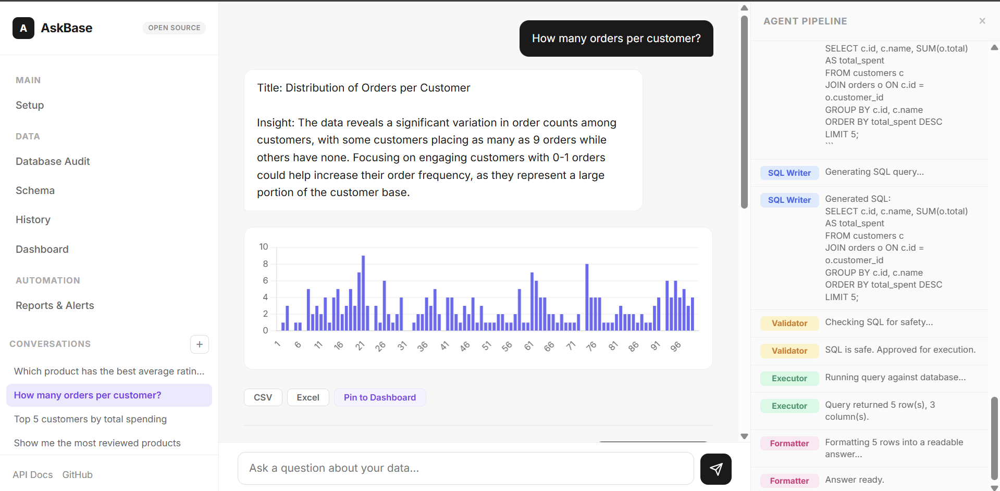

<p align="center">
  
</p>

<h1 align="center">AskBase</h1>

<p align="center">
  <strong>Talk to your database. Get answers instantly.</strong><br/>
  Open-source AI-powered natural language to SQL engine.
</p>

<p align="center">
  <a href="#quick-start">Quick Start</a> &bull;
  <a href="#features">Features</a> &bull;
  <a href="#architecture">Architecture</a> &bull;
  <a href="#api">API</a> &bull;
  <a href="https://github.com/gaetanyossa/Askbase">GitHub</a>
</p>

---

AskBase lets anyone query a database without writing SQL. Ask a question in plain language, and a multi-agent AI pipeline analyzes your schema, writes safe SQL, executes it, and returns a clear answer with charts. Works with BigQuery, PostgreSQL, MySQL and SQLite, and supports OpenAI, Claude and Gemini as LLM providers.



## Features

- **Natural language to SQL** -- ask questions in plain English (or any language), get answers from your database
- **Multi-agent pipeline** -- Orchestrator > Reasoner > Analyzer > SQL Writer > Validator > Executor > Formatter
- **Multi-database** -- BigQuery, PostgreSQL, MySQL, SQLite
- **Multi-LLM** -- OpenAI, Claude (Anthropic), Gemini (Google)
- **Live schema introspection** -- automatically reads your tables, columns, types, and FK relationships
- **Database Audit** -- AI-powered analysis of your database with editable reports
- **Auto-charts** -- automatic chart generation (bar, line, pie) based on query results
- **Dashboard** -- pin query results to a persistent dashboard with charts and context
- **Multi-conversation** -- create, switch and delete conversations with persistent history
- **Query History & Favorites** -- browse past queries, star your favorites
- **SQL Preview & Edit** -- view, copy, and re-run generated SQL queries
- **Export** -- CSV and Excel export for any query result
- **Scheduled Reports** -- cron-based reports delivered via Telegram
- **SQL safety** -- only SELECT queries allowed, dangerous keywords blocked
- **Agent trace** -- see the full pipeline reasoning in real time (SSE streaming)
- **Encrypted storage** -- credentials stored with AES-GCM in localStorage
- **Demo database** -- built-in e-commerce database (200 customers, 500 orders, 20 products)

## Quick Start

### Option 1: Docker (recommended)

```bash
git clone https://github.com/gaetanyossa/Askbase.git
cd Askbase
cp .env.example .env   # edit with your API key
docker compose up -d
```

Open [http://localhost:8080](http://localhost:8080) -- that's it!

### Option 2: Local Python

```bash
git clone https://github.com/gaetanyossa/Askbase.git
cd Askbase
python -m venv venv && source venv/bin/activate  # or venv\Scripts\activate on Windows
pip install -r requirements.txt
python app.py
```

Open [http://localhost:8080](http://localhost:8080)

### First Setup

1. Click **"Use Demo Database"** to try instantly, or choose your own database
2. Select your LLM provider (OpenAI, Claude, Gemini) and paste your API key
3. Click **Save and continue**
4. Start asking questions!

## Environment Variables

Configure via `.env` file (see `.env.example`):

```env
# LLM Provider: openai | anthropic | gemini
LLM_PROVIDER=openai
OPENAI_API_KEY=sk-...

# Database: bigquery | mysql | postgresql | sqlite
DB_TYPE=sqlite
SQLITE_PATH=demo.db

# PostgreSQL / MySQL
# DB_HOST=localhost
# DB_PORT=5432
# DB_NAME=my_database
# DB_USER=postgres
# DB_PASSWORD=

# BigQuery
# GOOGLE_APPLICATION_CREDENTIALS=path/to/service_account.json
# BIGQUERY_PROJECT=your-project-id
# BIGQUERY_DATASET=your_dataset

# General
MAX_ROWS=100
PORT=8080
```

## Architecture

AskBase uses an orchestrator-driven multi-agent pipeline. Each agent has a single responsibility. The Orchestrator decides the flow, the Reasoner deeply analyzes the question, and specialized agents handle SQL generation, validation, and formatting.

```
User Question
     |
     v
+--------------+
| Orchestrator |  Decides: chat, clarify, respond, or analyze
+------+-------+
       |
       v (analyze)
+----------+
|  Reasoner |  Deep analysis, reformulates question, identifies strategy
+-----+----+
      |
      v
+----------+
| Analyzer |  Inspects schema, finds tables/columns, writes SQL instructions
+----+-----+
     |
     v
+------------+
| SQL Writer |  Generates SQL from Analyzer's plan
+-----+------+
      |
      v
+-----------+
| Validator |  Safety check (SELECT only, no DROP/DELETE/UPDATE)
+-----+-----+
      |
      v
+----------+
| Executor |  Runs query against your database
+----+-----+
     |
     v
+-----------+
| Formatter |  Presents results with insights
+-----------+
```

Additionally:
- **Auditor** -- analyzes schema + sample data for a full database overview
- **Retry** -- if SQL fails, the SQL Writer auto-corrects and retries

## Project Structure

```
askbase/
├── app.py                 # FastAPI entry point
├── config.py              # Environment configuration
├── pipeline.py            # Main multi-agent pipeline
├── pipeline_stream.py     # SSE streaming wrapper
├── prompts.py             # All LLM prompt templates
├── scheduler.py           # Cron-based report scheduling
├── demo_db.py             # Demo e-commerce database generator
├── agents/
│   ├── orchestrator.py    # Routes questions to the right flow
│   ├── reasoner.py        # Deep question analysis
│   ├── analyzer.py        # Schema analysis & SQL planning
│   ├── sql_writer.py      # SQL generation & retry
│   ├── validator.py       # SQL safety checks
│   ├── executor.py        # Query execution
│   ├── formatter.py       # Result formatting
│   ├── auditor.py         # Database audit generation
│   ├── llm.py             # Unified LLM client (OpenAI/Claude/Gemini)
│   └── trace.py           # Agent communication logger
├── db/
│   ├── connection.py      # SQLAlchemy URL builder
│   ├── schema.py          # Live schema introspection
│   └── conversations.py   # Local SQLite for history & audit
├── routes/
│   └── api.py             # All REST/SSE endpoints
├── static/
│   ├── index.html         # Single-page application
│   ├── style.css          # UI styles
│   └── app.js             # Frontend logic
├── Dockerfile             # Multi-stage production build
├── docker-compose.yml     # One-command deployment
└── requirements.txt       # Python dependencies
```

## Docker

### Quick Deploy

```bash
docker compose up -d --build
```

### Manual Build

```bash
docker build -t askbase .
docker run -p 8080:8080 --env-file .env askbase
```

The Docker setup includes:
- Multi-stage build for smaller image size
- Non-root user for security
- Health check endpoint
- Persistent volume for conversations & audit data
- Pre-built demo database

## API

Interactive docs available at [http://localhost:8080/docs](http://localhost:8080/docs).

| Endpoint | Method | Description |
|----------|--------|-------------|
| `/api/ask` | POST | Ask a question (synchronous) |
| `/api/ask-stream` | POST | Ask a question (SSE streaming with live trace) |
| `/api/schema` | POST | Get live database schema |
| `/api/execute-sql` | POST | Execute raw SQL (SELECT only) |
| `/api/audit` | GET | Get saved database audit |
| `/api/audit` | PUT | Update audit text |
| `/api/audit-stream` | POST | Generate database audit (SSE streaming) |
| `/api/demo` | POST | Activate demo database |
| `/api/upload-credentials` | POST | Upload BigQuery credentials |
| `/api/schedules` | GET/POST | List or create scheduled reports |
| `/api/schedules/{id}` | DELETE | Delete a scheduled report |
| `/api/history` | GET | Get conversation history |
| `/api/restore-history` | POST | Restore conversation from client |

## Tech Stack

| Layer | Technology |
|-------|-----------|
| Backend | Python 3.12, FastAPI, SQLAlchemy |
| Frontend | Vanilla HTML / CSS / JS, Chart.js |
| LLM | OpenAI-compatible API (OpenAI, Anthropic, Google) |
| Databases | BigQuery, PostgreSQL, MySQL, SQLite |
| Deployment | Docker, Docker Compose |

## Contributing

Contributions are welcome! Feel free to open issues or submit pull requests.

## License

MIT
